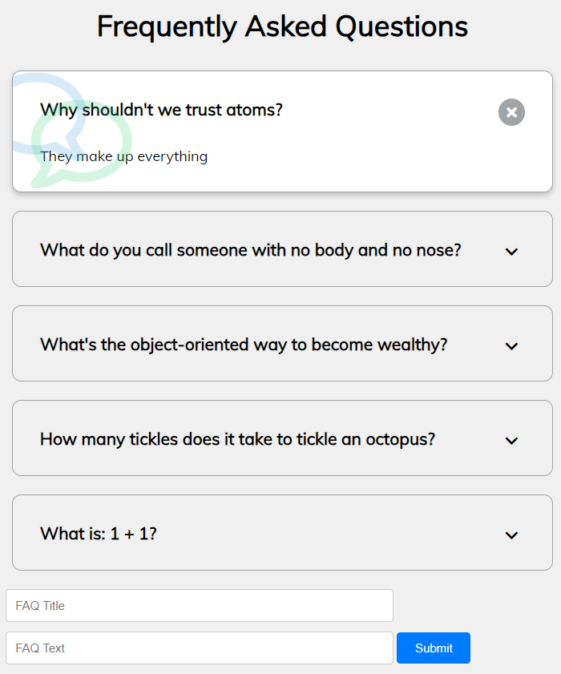

# Lab-Exams
This Repo is for my University Web Lab Exams

<h3> AKU Clone</h3>
It is the frontend clone of Aga Khan University
 

<h3> FAQ - Frequently asked questions</h3>
Created a FAQ web page where you can add a new FAQ (Frequently Asked Questions) and clicking it will show the answer and inherit the styles. You can add a new FAQ and its answer

